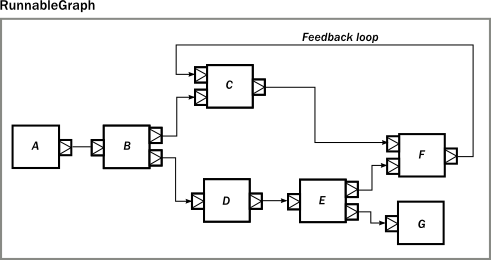
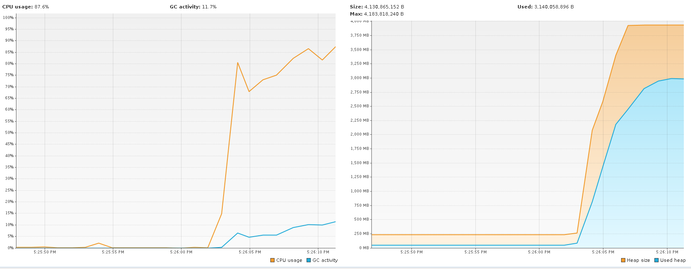
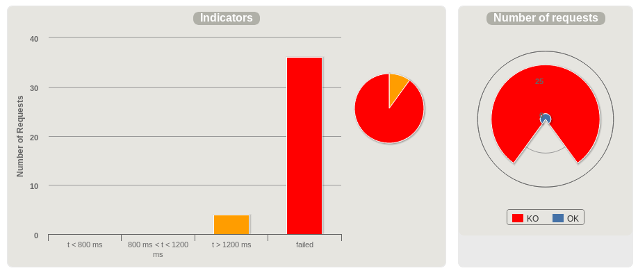
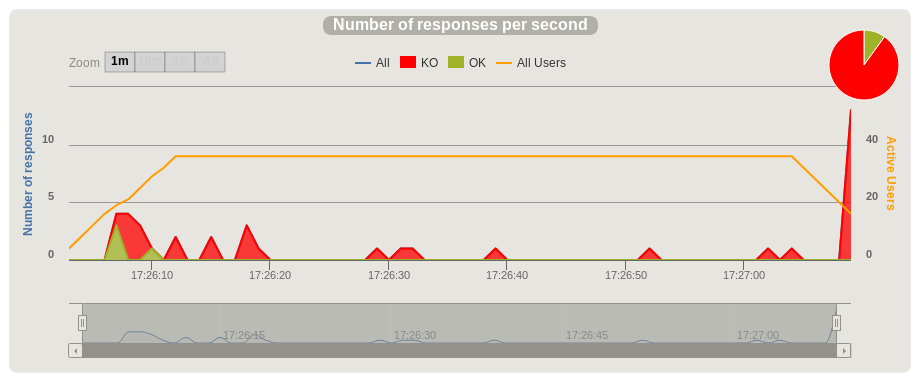
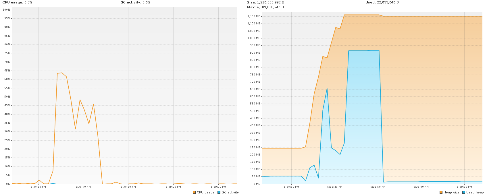
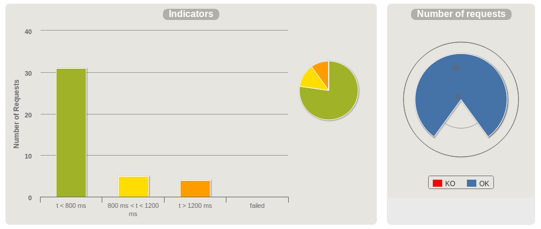
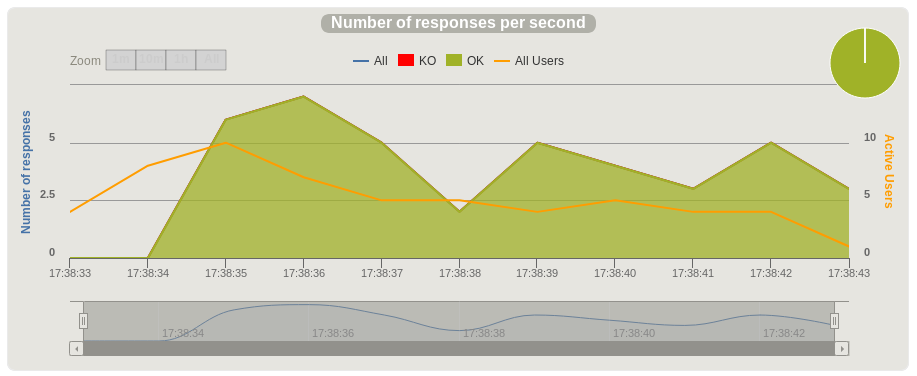
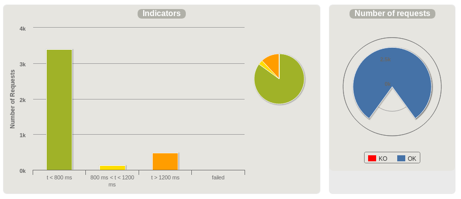
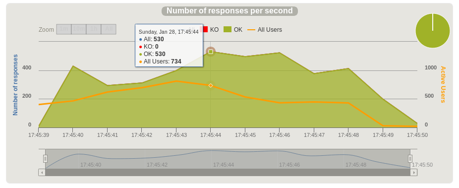

@@@section { data-background="#15a9ce" }

### Handle Intense Workloads with Backpressure and Reactive Streams

##### Arnout Engelen

@@@

@@@section

Agenda:

1. Reactive Streams
1. Akka Streams
1. Akka HTTP
1. Demo!

@notes[
What to expect<br>
* history, concepts and scope of reactive streams<br>
* Close look at main concepts of one RS impl: Akka Streams<br>
* how Akka Streams is really at the core of the Akka HTTP lib<br>
* A 'live' example of an Akka HTTP application leveraging streams
]

@@@

@@@section

# 1. Reactive Streams

@notes[So let's start with Reactive Streams. To better understand the reactive streams initiative it makes sense to look at some history of there this effort came from<br>Time: 11:55]

@@@

@@@section


Open Source toolkit for building Concurrent, Distributed, Resilient Message-Driven applications on the JVM

@notes[Akka grew out of the realization, circa 2009, that threads are a heavyweight abstraction that is hard to make resilient. Inspired by Erlang, asynchronous model, actor model, but not covering that today.]

@@@

@@@section

### Traditional synchronous model

@@snip[Synchronous.java]($root$/src/main/java/rs/async/Synchronous.java){#service}

@@snip[Synchronous.java]($root$/src/main/java/rs/async/Synchronous.java){#perform}

@notes[As a refresher on the advantages of async code I have a tiny example. This should look familiar to most of you, right? a number of tasks are performed by a service]

@@@

@@@section

### Asynchronous approach

@@snip[x]($root$/src/main/java/rs/async/Asynchronous.java){#actor}

@@snip[x]($root$/src/main/java/rs/async/Asynchronous.java){#enqueue}

@notes[Same trivial snippet in Actor. Main diff: task in mailbox. Saves threads.<br>
Resilience. Back a slide, highlight the sending thread no longer has to deal with the exception<br>
Coordination also much easier when using message passing<br>
Nothing new: smalltalk, erlang<br>
Note: there are of course many ways to make a system asynchronous, and I'm sure many of you have introduced asynchronous boundaries on your own perhaps even with using a library. Actors are just a particularly nice way to achieve it.]

@@@

@@@section

## Akka toolkit

Actor model

@span[Clustering]{ .fragment }

@span[Persistence (Event Sourcing)]{ .fragment }

@span[HTTP]{ .fragment } 

@span[[Reactive Manifesto](https://www.reactivemanifesto.org)]{ .fragment }

@notes[So the actor is the basic building block in Akka, but the library contains more: it turned out that the abstractions for concurrency and resiliency in the actor model lend themselves very well for modelling distributed systems, so Akka grew modules for clustering, persistence, and a HTTP stack.<br>Excellent fit for building systems that have the properties of the Reactive Manifesto]

@@@

@@@section

### So far the good news...

@@snip[x]($root$/src/main/java/rs/async/Asynchronous.java){#actor}

@@snip[x]($root$/src/main/java/rs/async/Asynchronous.java){#enqueue}

@@@

@@@section { data-background-video="fishermen.mp4" }

# @span[OutOfMemoryError]{.orange .fragment}

@notes[Akka is by no means the only approach to asynchronous programming: Node.js, RxJava for example also exploring the same space. And they all ran into the problem of message targets not being able to keep up. Not impossible to solve, but solutions (e.g. ack'ing etc) ad hoc and not composable. This lead to a number of players in industry identifying the need for an interoperable mechanism to get asynchronous, backperssured streams: the Reactive Streams initiative]

@@@

@@@section { data-background="#489ebd" }

### Reactive Streams Timeline


@notes[Industry got together under Reactive Streams working group initiated by Viktor Klang of the Akka Team (not limited to JVM)]

@@@

@@@section { data-background="#489ebd" }

### Reactive Streams Scope

Reactive Streams is an initiative to provide a standard for asynchronous stream processing with non-blocking back pressure. This encompasses efforts aimed at runtime environments (JVM and JavaScript) as well as network protocols

http://www.reactive-streams.org

@@@

@@@section

### `java.util.concurrent.Flow`

@@snip[rs]($root$/src/main/java/rs/Publisher.java) { #rs }
@@snip[rs]($root$/src/main/java/rs/Subscriber.java) { #rs }
@@snip[rs]($root$/src/main/java/rs/Subscription.java) { #rs }
@@snip[rs]($root$/src/main/java/rs/Processor.java) { #rs }

@notes[Most significant milestone was the inclusion of the RS interfaces in JDK9
If you're not on JDK9 you can use the org.reactivestreams library.]

@@@

@@@section

### Availablility

Included in JDK9

No JDK9? No problem!

```
<dependency>
  <groupId>org.reactivestreams</groupId>
  <artifactId>reactive-streams</artifactId>
  <version>1.0.2</version>
</dependency>
```

@@@

@@@section

### Specifications

* 11-17 requirements (some subtle). Each.
* Technology Compatibility Kit (TCK)

@notes[simplicity is deceptive: TCK for conformance checking. Originally planned: both user-facing API and an interoperability API. User-facing scrapped ~2014 so libraries can provide their own, ideomatic impl.]

@@@

@@@section

# 2. Akka Streams

@notes[Before we start: hands up Java/Scala experience? Will show a bit of both.<br>Time: 12:05-12:10]

@@@

@@@section


@notes[starts of our story]

@@@

@@@section

@@snip[x]($root$/src/main/java/streams/Intro.java){#source-no}
@@snip[x]($root$/src/main/java/streams/Intro.java){#flow-no group="x fragment"}
@@snip[x]($root$/src/main/java/streams/Intro.java){#sink-no group="x fragment"}

@notes[Before we dive into the specifics, let's start with some small examples to get a feel]

@@@

@@@section

@@snip[x]($root$/src/main/java/streams/Intro.java){#source}
@@snip[x]($root$/src/main/java/streams/Intro.java){#flow}
@@snip[x]($root$/src/main/java/streams/Intro.java){#sink}
@@snip[x]($root$/src/main/java/streams/Intro.java){#graph group="x fragment"}
@@snip[x]($root$/src/main/java/streams/Intro.java){#run group="x fragment"}

@@@

@@@section

@@snip[x]($root$/src/main/scala/sstreams/Intro.scala){#source}
@@snip[x]($root$/src/main/scala/sstreams/Intro.scala){#flow}
@@snip[x]($root$/src/main/scala/sstreams/Intro.scala){#sink}
@@snip[x]($root$/src/main/scala/sstreams/Intro.scala){#graph group="x fragment"}
@@snip[x]($root$/src/main/scala/sstreams/Intro.scala){#run group="x fragment"}

@@@

@@@section

Java:

@@snip[x]($root$/src/main/java/streams/Intro.java){#short}

Scala:

@@snip[x]($root$/src/main/scala/sstreams/Intro.scala){#short}

@notes[we really try to make the API really easy to use for Java and Scala]


@@@

@@@section

## Materialization

@@snip[x]($root$/src/main/java/streams/Materialization.java){#multiple}

@notes[running = 2-stage: build graph, run graph. run = materialization. Same graph can be materialized multiple times.]

@@@

@@@section

## Materialized values

@@snip[x]($root$/src/main/java/streams/Materialization.java){#source}

@note[Streams and actors go well together, default left]

@@@

@@@section

## Materialized values

@@snip[x]($root$/src/main/java/streams/Materialization.java){#sink}

@note[Streams and actors go well together, default left]

@@@


@@@section

## Actor materialization

@@snip[x]($root$/src/main/java/streams/Materialization.java){#fusing}


@notes[Advantage of 2-phase: reusable building blocks, but opportunity for optimizations at materialization time]

@@@

@@@section

# Fusing

@@snip[x]($root$/src/main/java/streams/Materialization.java){#fusing-explicit-async}


@@@

@@@section

# Fusing

@@snip[x]($root$/src/main/java/streams/Materialization.java){#fusing-async}


@@@

@@@section

## Backpressure propagation

Demand is signalled across async boundaries


@@@

@@@section

## Backpressure propagation

Thanks to Reactive Streams, across different libraries:


@@@

@@@section

## Backpressure propagation

Often also possible across external protocols, i.e. TCP:


@span[]{.fragment}

@@@

@@@section

## Backpressure propagation

Can be seen in e.g. wireshark:


@notes[and keeps heartbeating]

@@@

@@@section

## Live demo time!

@notes[TCP server from scratch, throttling and backpressure demo, with netcat and showing the send/recv queues in ss]

@@@

@@@section

## We've only just begun...



@notes[Only scratched the surface, many combinators to create complex graphs, custom shapes, fan in/out, materialization. Not important to show backpressure though.]

@@@

@@@section

# 3. Akka HTTP

@notes[So far: might seem lowlevel, but usable to build higher-level abstractions, i.e. Akka HTTP. Will show some of the API, highlighting how Akka streams is the foundation<br>Time: 12:20-12:35]

@@@

@@@section

## Binding

@@snip[x]($root$/src/main/java/http/Basics.java){#init}
@@snip[x]($root$/src/main/java/http/Basics.java){#bind group="x fragment"}
@@snip[x]($root$/src/main/java/http/Basics.java){#run group="x fragment"}
@@snip[x]($root$/src/main/java/http/Basics.java){#log group="x fragment"}

@@@

@@@section

## Connection

Is a `Flow[Response, Request, _]`:

@@snip[x]($root$/src/main/java/http/Basics.java){#flow}

@span[Or provide your `Flow[Request, Response, _]`:]{.fragment}

@@snip[x]($root$/src/main/java/http/Basics.java){#handleWith group="x fragment"}

@@@

@@@section

## http.bindAndHandle()

@@snip[x]($root$/src/main/java/http/Basics.java){#bindAndHandle}

@notes[Remember materialization? This is so easy because the Flow is a blueprint that can be materialized many times]

@@@

@@@section

## Routing DSL

@@snip[x]($root$/src/main/java/http/Routing.java){#simple}

@@snip[x]($root$/src/main/java/http/Routing.java){#run group="x fragment"}

@@@

@@@section

## Example: numbers 

@notes[Wrap an Akka HTTP application around the numbers demo from the Akka Streams section]

@@@

@@@section

## Path matching

@@snip[x]($root$/src/main/java/http/Routing.java){#simple}

@@snip[x]($root$/src/main/java/http/PathApi.java){#pathApi1 group="x fragment"}
@@snip[x]($root$/src/main/java/http/PathApi.java){#pathApi group="x fragment"}

@@@

@@@section

@@snip[x]($root$/src/main/java/http/PathApi.java){#pathApi}

@@snip[x]($root$/src/main/java/http/PathMatching.java){#segment}

@@snip[x]($root$/src/main/java/http/PathMatching.java){#staticimports group="x fragment"}

@@snip[x]($root$/src/main/java/http/PathMatching.java){#segments group="x fragment"}

@@@

@@@section

@@snip[x]($root$/src/main/java/http/PathMatching.java){#advanced}

This will match paths like `foo/bar/X42/edit` or `foo/bar/X37/create`.

@notes[Possible stretch topics here: Path concatenation/Nested routes, error handling]

@@@

@@@section

## Other Akka HTTP features

Client API

@span[Server-side HTTP/2]{.fragment}

@span[Marshalling API]{.fragment}

@span[Content negotiation]{.fragment}

@@@

@@@section


 

@notes[Conclusion: Akka and Akka Streams foundation, leveraged by Akka HTTP and other libraries]

@@@

@@@section

# 4. Demo

@notes[Time: 12:30-12:45]

@@@

@@@section

## Challenge

* HTTP front-end
* FTP back-end

@@@

@@@section { data-background="alpakka.jpg" }

# @span[Alpakka]{.orange}

@@@

@@@section

## Alpakka

Community for Akka Streams connectors

@span[[https://github.com/akka/alpakka](https://github.com/akka/alpakka)]{.fragment}

@notes[A bit like Apache Camel, but for Akka Streams]

@@@

@@@section


@@@

@@@section

## FTP client

@notes[Start of live demo: fetch directory contents from FTP. (Could also move to end of Akka Streams section.)]

@@@

@@@section

## Exposed via HTTP

@notes[Naive implementation with `Sink.reduce(_ + _)`. <br>
Interaction moment: who spotted the security issue?
]

@@@

@@@section

@@@@section

## Let's put some load on it!


@@@@

@@@@section



@@@@

@@@@section



@@@@

@@@@section



@@@@

@@@

@@@section

## Stream the entity

@@snip[x]($root$/src/main/java/demo/FtpServerHttpApp.java){#streamResponseEntity}

@@@

@@@section

@@@@section

## Let's go again!


@@@@

@@@@section



@notes[Check the scale! Fairly healthy, though gc churns]

@@@@

@@@@section



@@@@

@@@@section



@@@@

@@@

@@@section

@@@@section

## With room to spare


@@@@

@@@@section



@@@@

@@@@section



@@@@

@@@


@@@section

# Re-cap

Backpressure prevents overload

@span[Reactive Streams for integration]{.fragment}

@span[e.g. Akka Streams to implement]{.fragment}

@span[e.g. Akka HTTP to leverage]{.fragment}

@notes[Backpressure protects against overloading the target of an asynchronous non-blocking stream. Reactive Streams makes this work end-to-end, use a library like Akka Streams, Akka HTTP is built on top of Akka Streams and benefits from it.]

@@@

@@@section

## Happy hAkking!

Slides & Code
:  [github.com/raboof/akka-http-backpressure](https://github.com/raboof/akka-http-backpressure)

Docs & QuickStarts
:  [akka.io](https://akka.io), [developer.lightbend.com/start](https://developer.lightbend.com/start)

Community
: [gitter.im/akka/akka](https://gitter.im/akka/akka)

Tweet
: [@akkateam](https://twitter.com/akkateam), [@raboofje](https://twitter.com/raboofje)

@notes[And talk to me afterwards :). Time: 12:45-12:55]

@@@
